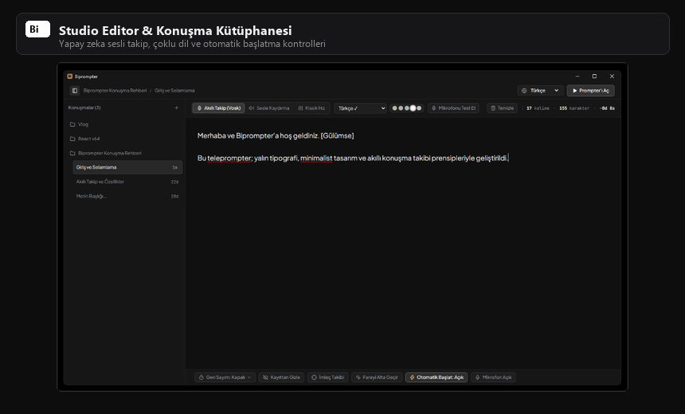
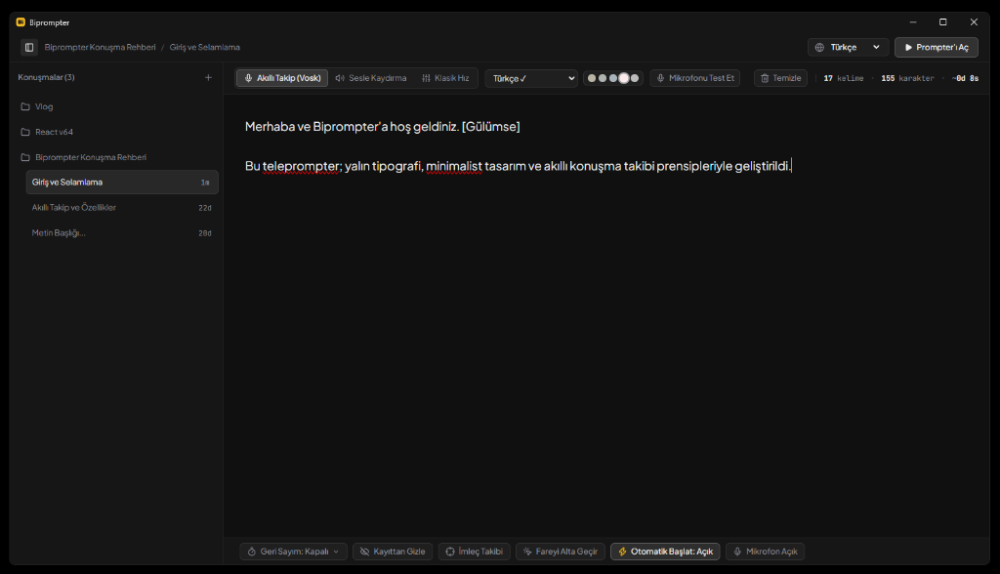
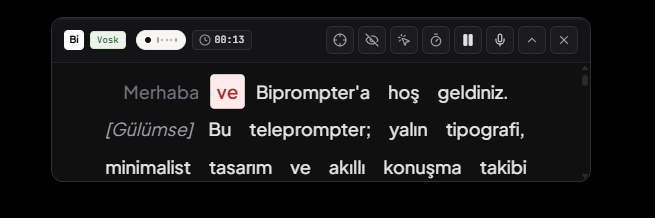

<p align="center">
  
</p>

<h1 align="center">Biprompter</h1>

<p align="center">
  <strong>Windows için yeni nesil, Apple Dynamic Island estetiğinde, yapay zekâ ses takipli ve %100 yerel teleprompter.</strong>
</p>

<p align="center">
  
  
  
  
  
</p>

---

## 🎬 Genel Bakış & Demo

**Biprompter**, kamera karşısında video çekenler, canlı yayın yapanlar, podcast üreticileri, eğitimciler ve online toplantılarda sunum yapan profesyoneller için geliştirilmiştir.

Ekranda devasa bir pencere kaplamak yerine, ekranın üst kenarında **Mac Dynamic Island** gibi zarifçe yüzen, sesi mikrofondan sıfır gecikmeyle dinleyip siz konuştukça kelime kelime ilerleyen modern bir deneyim sunar.

<p align="center">
  
</p>

---

## ✨ Öne Çıkan Özellikler

### 🎙️ 1. Akıllı Ses Takibi (Vosk Speech AI - %100 Çevrimdışı)
- Konuşma hızınızı önceden ayarlamanıza gerek yok. Siz hızlı konuşursanız hızlanır, duraklarsanız durur, geri dönerseniz otomatik yakalar.
- **WebAssembly** üzerinde çalışır; internet bağlantısına ihtiyaç duymaz, ses verileriniz hiçbir zaman harici bir sunucuya gönderilmez.
- 12 farklı dilde (Türkçe, İngilizce, Almanca, İspanyolca, Fransızca, Rusça, Japonca vb.) hafif dil modellerini tek tıkla indirip kullanabilirsiniz.

### 🏝️ 2. Mac Dynamic Island Modu
- Ekranın üst kısmında yarı saydam, estetik bir hap kapsülünde çalışır.
- Kapsülün saydamlığı `%0` ile `%100` (tamamen şeffaf, sadece yüzen yazı) arasında milimetrik olarak ayarlanabilir.

### 🔽 3. Minimalist Çentik & Ok Modu
- Tek bir tuşla (`Alt + D`) ekranın en üst noktasına küçülür ve arkasındaki tüm pencereleri kapatmadan sadece küçük bir **aşağı ok ikonu** olarak bekler.
- Oka tıkladığınız anda akıcı bir şekilde aşağı doğru genişler ve konuşmanıza kaldığınız yerden devam edebilirsiniz.
- Köşelerde veya kenarlarda hiçbir boyutlandırma imleci çıkmaz; pürüzsüz ve temiz bir masaüstü deneyimi sunar.

### 👻 4. Hayalet Modu (OBS & Ekran Paylaşımından Gizleme)
- `Alt + G` kısayoluyla tek tıkla aktifleşir.
- Windows DWM Affinity API'sini (`WDA_EXCLUDEFROMCAPTURE`) kullanarak prompteri **OBS Studio, Zoom, Microsoft Teams, Google Meet ve Discord** ekran paylaşımlarında görünmez kılar.
- Siz kameranın tam altına yerleştirip metni rahatça okurken izleyicileriniz veya kayıt alan program ekranınızdaki prompteri asla görmez!

### 🖱️ 5. Tıklama Geçirgenliği (Click-Through - `Alt + C`)
- Prompter açıkken arkasındaki VS Code, tarayıcı veya sunum slaytlarını kullanmanız mı gerekiyor?
- `Alt + C` bastığınızda fare tıklamaları doğrudan prompterin altındaki pencerelere geçer. Prompteri kapatmadan arkanızdaki uygulamaları kontrol edebilirsiniz.

### 🎯 6. İmleç Takip Modu (`Alt + M`)
- Prompter farenizi takip eder ve ekranda nereye giderseniz yumuşak bir fizik motoruyla (glide damping) arkasından süzülür.

### 🎭 7. Akıllı Sahne & Reji Yönergeleri
- Metninizde `[Gülümse]`, `[Nefes al]`, `[Durakla]`, `[Kameraya Bak]` gibi köşeli parantez içinde yazdığınız tüm sahne direktiflerini otomatik algılar.
- Bu yönergeler farklı renk ve italik biçimde gösterilir; ses motoru bu kelimeleri konuşma metni sanıp beklemez, akışı kesintisiz sürdürür.

### ⏱️ 8. Geri Sayım & Otomatik Başlat
- **Otomatik Başlat:** Açık olduğunda "Prompter'ı Aç" dediğiniz an akış konuşmanızı dinlemeye başlar.
- **Prompter İçi Geri Sayım:** Akış esnasında üst çubuktaki zamanlayıcı butonuna basarak anında `3.. 2.. 1..` geri sayımı başlatabilir, hazırlığınızı tamamlayabilirsiniz.

---

## 🖼️ Ekran Görüntüleri

### 🎛️ 1. Studio Editör & Konuşma Kütüphanesi
Yazılarınızı hazırlayabileceğiniz, ses tanıma dilini seçebileceğiniz ve konuşma hızını ayarlayabileceğiniz ana kontrol paneli:



---

### 🏝️ 2. Mac Dynamic Island Prompter Kapsülü
Ekranın üstünde yüzen, sesinizi anlık dinleyip kelimeleri gerçek zamanlı vurgulayan (`ve`), reji yönergelerini (`[Gülümse]`) gösteren ve canlı kontrolleri barındıran akıllı ada kapsülü:



---

### 🔽 3. Minimalist Çentik (Zıplayan Ok) Modu
Prompteri tek bir tuşla veya kısayolla (`Alt + D`) ekranın en tepesine küçülterek sadece zıplayan bir ok ikonuna dönüştüren minimalist mod:

<p align="center">
  
</p>

---

### 🎬 4. Canlı Akış & Modlar Arası Geçiş (Animasyonlu Önizleme)
Editörden promptere ve minimal ok moduna geçişin canlı animasyonlu önizlemesi:


---

## ⌨️ Klavye Kısayolları

Biprompter, Windows üzerinde küresel (global) sistem kısayollarını destekler. Başka bir programda olsanız dahi tek tuş kombinasyonuyla yönetebilirsiniz:

| Kısayol | İşlev |
| :--- | :--- |
| **`Alt + P`** veya **`Boşluk`** | Prompteri Başlat / Duraklat |
| **`Alt + D`** | Dynamic Island & Çentik (Ok) Modu Arasında Geçiş Yap |
| **`Alt + C`** | Tıklama Geçirgenliğini Aç / Kapat (Fareyi alta geçir) |
| **`Alt + G`** | Hayalet Modu (OBS / Ekran Paylaşımından Gizle) |
| **`Alt + M`** | Fare İmlecini Takip Et |
| **`Alt + S`** | Mikrofonu Sustur (Mute) / Aç |
| **`Alt + X`** veya **`ESC`** | Prompteri Kapat ve Editöre Dön |
| **`PageUp` / `PageDown`** | Önceki / Sonraki Bölüme (Chapter) Atla |
| **`↑` / `↓`** | Klasik veya Sesli Akış Hızını Arttır / Azalt |
| **`→` / `←`** | Yazı Boyutunu Büyüt / Küçült |

---

## 🛠️ Mimari & Teknoloji Yığını

Biprompter, modern web teknolojilerinin esnekliği ile yerel masaüstü sistemlerinin (Rust/C++) hız ve gücünü bir araya getiren hibrit ve modüler bir mimari üzerine inşa edilmiştir:

```mermaid
flowchart TD
    subgraph Native["🦀 Masaüstü Katmanı (Rust & Tauri v2)"]
        Win32["Win32 Native API (user32, dwmapi)"]
        Shortcuts["Global Klavye Kısayolları (Alt+D, Alt+G, Alt+C)"]
        Ghost["OBS / Yayın Gizleme (SetWindowDisplayAffinity)"]
        Dock["Dynamic Island Pencere Boyutlandırma & Çentik"]
    end

    subgraph Bundler["⚡ Paketleyici & Kabuk (Astro 5 + Vite)"]
        AstroShell["index.astro (Statik Host Kabuğu)"]
        ViteBuild["Vite Rollup Modül Paketleyici"]
        TailwindEngine["Tailwind CSS v4 Derleyicisi"]
    end

    subgraph Frontend["⚛️ Arayüz & Uygulama Mantığı (React 19 & TypeScript)"]
        IslandPrompter["IslandPrompter (Dynamic Island & Zıplayan Ok)"]
        EditorView["EditorView (Stüdyo Editör & Ayar Paneli)"]
        Vosk["Vosk Speech AI (WebAssembly Çevrimdışı Tanıma)"]
        Tracker["useSpeechTracker & Kelime Eşleştirme Motoru"]
    end

    Native <-->|Tauri IPC (Invoke / Event)| Frontend
    Bundler -->|Statik Çıktı /dist| Native
```

### 🦀 1. Masaüstü & Sistem Katmanı: Tauri v2 (Rust)
- **Neden Tauri & Rust?:** Klasik Electron uygulamaları arkasında tam teşekküllü bir Chromium tarayıcısı ve Node.js sunucusu çalıştırdığı için 300-500 MB RAM tüketir. Biprompter ise sistemin kendi yerel Webview bileşenini kullanan **Rust tabanlı Tauri v2** ile çalışır; bu sayede RAM tüketimi **~35-45 MB** civarındadır.
- **Doğrudan Win32 API Erişimi:**
  - `user32.dll` & `dwmapi.dll` çağrılarıyla pencere kenarlıklarını boyutlandırmayı engeller (`WS_THICKFRAME` yönetimi),
  - `SetWindowDisplayAffinity` ile OBS, Zoom ve Teams gibi yazılımlarda pencereyi yayından gizler (Hayalet Ekran modu),
  - Başka bir pencerede olsanız dahi `Alt + D`, `Alt + G`, `Alt + P` gibi küresel kısayolları mikro-saniyelik gecikmeyle yakalar.

### ⚡ 2. Paketleyici & Statik Kabuk: Astro 5 + Vite
- **Astro Projede Ne Yapıyor?:** Tauri, ön yüz tarafında statik HTML/CSS/JS dosyaları bekler. [astro.config.mjs](astro.config.mjs) projenin ana derleme ve paketleme orkestrasyonunu üstlenir.
- [src/pages/index.astro](src/pages/index.astro) dosyası, Tauri için sıfır fazlalık içeren temiz bir statik kabuk görevi görür ve React uygulamasını (`<BiprompterApp client:only="react" />`) webview içerisine enjekte eder.
- Arka planda **Vite** ile çalışarak anlık Hot Module Replacement (HMR) ve optimize edilmiş küçük dosya boyutları üretir.

### ⚛️ 3. Arayüz & Durum Yönetimi: React 19 & TypeScript
- Gördüğünüz tüm etkileşimli arayüz, metin editörü, kelime vurguları, ses dalgası görselleştiricisi ve animasyonlar saf **React 19** ve **TypeScript** ile geliştirilmiştir:
  - `IslandPrompter.tsx`: Yüzen Dynamic Island kapsülü ve tek tıkla açılan zıplayan ok modu.
  - `useSpeechTracker.ts`: Konuşulan ses metinlerini prompter metnindeki kelimelerle milisaniyelik eşleştiren (`PromptMatcher`) algoritma.
  - `usePrompterScroll.ts`: Konuşma hızına ve WPM değerine göre metni takılmadan kaydıran fizik tabanlı animasyon döngüsü (`requestAnimationFrame`).

### 🧠 4. Yapay Zekâ & Konuşma Motoru: Vosk (WebAssembly)
- **Gizlilik Odaklı & Çevrimdışı:** Konuşmanızı harici bir bulut servisine (Google Speech, Whisper API vb.) göndermez.
- WebAssembly (Wasm) ve AudioWorklet ile doğrudan istemci bilgisayarında yerel çalışır. 12 farklı dildeki hafif modelleri kullanıcının isteğiyle tarayıcı önbelleğine (IndexedDB) indirip tamamen internetsiz okuma sağlar.

### 🎨 5. Tasarım Sistemi: Tailwind CSS v4 & Lucide
- **Tailwind CSS v4:** `@tailwindcss/vite` eklentisiyle sıfır CSS-in-JS maliyeti, GPU destekli bulanıklık efektleri (`backdrop-blur-md`) ve Antigravity Dark Obsidian renk paleti (`#0D0D0E`, `#161616`, `#2E2E32`).
- **Lucide React:** Tutarlı, hafif ve modern SVG ikon seti.

---

## 🚀 Kurulum & Geliştirme

### Gereksinimler
- [Node.js](https://nodejs.org/) (v18 veya üzeri)
- [Rust & Cargo](https://rustup.rs/) (Windows için MSVC toolchain)

### Projeyi Çalıştırma

```bash
# 1. Depoyu klonlayın
git clone https://github.com/serhatkochan/biprompter.git
cd biprompter

# 2. Bağımlılıkları yükleyin
npm install

# 3. Geliştirme modunda (Tauri + Vite) başlatın
npm run tauri dev
```

### Windows İçin Exe / MSI Paketi Derleme

```bash
npm run tauri build
```
Derlenen `.msi` ve `.exe` kurulum dosyaları `src-tauri/target/release/bundle/` altında otomatik olarak üretilecektir.

---

## 🔒 Gizlilik Politikası

- **Hiçbir Veri Toplanmaz:** Biprompter herhangi bir analitik, telemetri, izleme kodu veya üçüncü taraf takip kütüphanesi içermez.
- **%100 Yerel Veri Saklama:** Konuşma metinleriniz ve ayarlarınız sadece bilgisayarınızdaki yerel `localStorage` üzerinde saklanır.
- **Harici API Yok:** Konuşma modelleri doğrudan açık kaynaklı resmi Vosk aynalarından indirilir; sesiniz hiçbir zaman internete yüklenmez.

---

## 📄 Lisans

Bu proje [MIT Lisansı](LICENSE) kapsamında açık kaynak olarak lisanslanmıştır. Dilediğiniz gibi geliştirebilir, değiştirebilir ve ticari veya kişisel projelerinizde kullanabilirsiniz.
